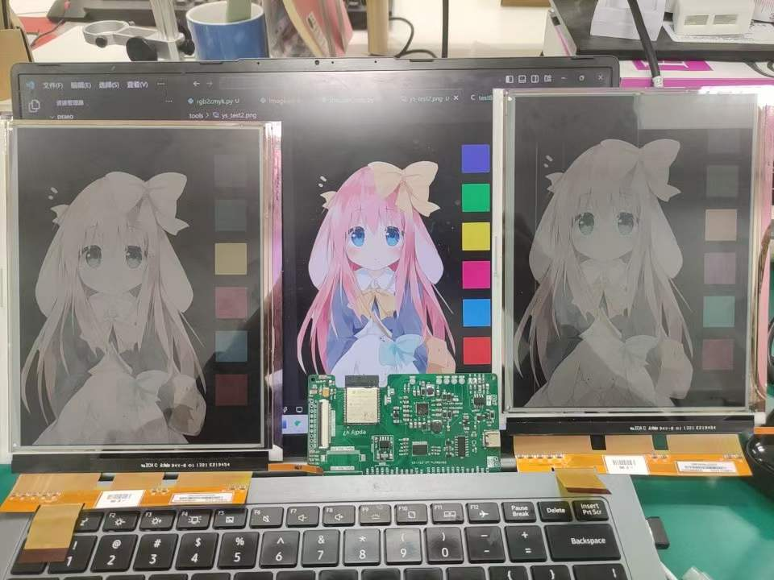
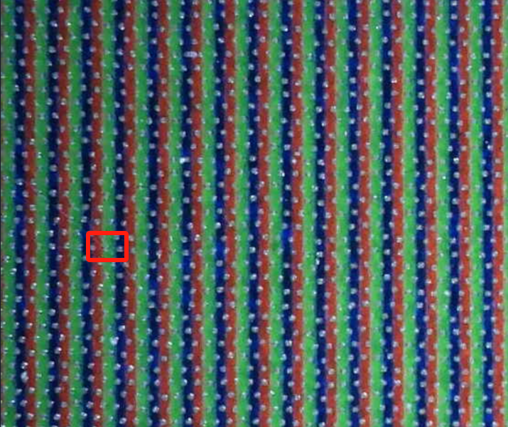

# EPDIY-EC080SC2
## 概述
EC080SC2是来自元太科技的的一款`800*600`分辨率的E-ink墨水屏幕，采用滤光片实现彩色效果，实际驱动方式与16位灰阶墨水屏无异。本仓库尝试使用EPDIY-V7硬件结合EPDIY组件，开发彩色效果。
## TO DO
- [x] 实现彩色图片显示 
- [ ] 重构EPDIY，使之支持彩色墨水屏 
## 效果展示

## 使用方法
1. 将[epdiyv2.0](https://github.com/vroland/epdiy)复制`components`文件夹。可参考[espidf](https://docs.espressif.com/projects/esp-idf/zh_CN/latest/esp32/api-guides/tools/idf-component-manager.html)
2. 执行`tools/rgb2arr_color.py`，将**无透明通道**的图片传入，生成`.h`格式图像文件
3. 在`main.c`当中使用`epd_draw_color_image`将图像载入缓冲区，随后显示即可(类似 `epd_draw_rotated_image`) 

## 原理阐释
本屏幕的每个像素由横向排列的三个子像素构成，因而在短边(彩色分辨率600p侧)实际分辨率达到1800p，仅需要将800p图像的RGB三个通道依次显示在1800p的屏幕上即可
<div style="text-align: center;">
    <br />
    显微图像(红圈为一个像素)
</div>

## TBD
时间仓促，仅依赖原版epdiy2.0实现了图像转换脚本以及一些适配EC080SC2彩色图像显示的临时函数(均在main.c)，亟待整合进入脚本或更新库文件~

## TIPs
1. `tools/rgb2arr_color.py` 脚本中注释了一些还没封装为选项的操作，有cmy格式显示，色彩抖动算法等~
2. `tools/rgb2arr_color.py` 执行报错请检查图片是否有透明通道，如有，请移除，或修改32-33行为
   ``` python
   # 获取当前像素的RGB值
            r1, g1, b1, _ = pixels[y, 2*x]
            r2, g2, b2, _ = pixels[y, 2*x+1]
   ```

## Licenses
本项目依托于[epdiy](https://github.com/vroland/epdiy)项目
<br />
以[GNU Lesser GPL version 3](https://www.gnu.org/licenses/lgpl-3.0.zh-cn.html)分发